# **_HistoryOnics_**

HistoryOnics is a tourist history website that focuses on each province of Ireland. 
The site aims to provide information about Irelands' history and interesting places 
to visit for both local and international tourists. The site provides maps and videos 
of each county, within each province and links to social media for users to interact 
with the site. The User can also contact the site should they have more queries. 

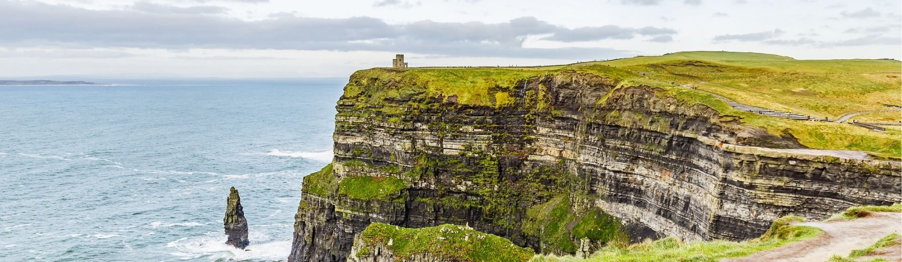

Link to live site - [HistoryOnics](https://toby7658.github.io/History-Onics/)

# Table of Contents

* [**User Experience UX**](<#user-experience-ux>)
    * [User Interaction](<#user-interaction>)
    * [User Stories](#user-stories>)
    * [Wireframe](<#wireframe>)
    * [Structure of Site](<#structure-of-site>)
    * [Typography](<#typography>)
    * [Colour Scheme](<#colour-scheme>)

* [**Existing Features**](<#existing-features>)
    * [Navigation Menu](<#navigation-menu>)
    * [Hamburger Bar](<#hamburger-bar>)
    * [Logo](<#logo>)
    * [Hero Image](<#hero-image>)
    * [Navigation Blocks](<#navigation-blocks>)
    * [Social Media](<#social-media>)
    * [Videos](<#videos>)
    * [Maps](<#maps>)
    * [Contact Us](<#contact-us>)
    * [Form Submission](<#form-submission>)
    * [About Us](<#about-us>)
    * [Footer](<#footer>)

* [**Future Features**](<#future-features>)

* [**Technologies Used**](<#technologies-used>)
  * [HTML](#html)
  * [CSS](#css)
  * [Google Fonts](#google-fonts)
  * [Font Awesome Icons](#font-awesome-icons)
  * [balsamiq](#balsamiq)
  * [GitHub](#gitHub)
  * [Git](#git)
  * [Gitpod](#gitpod)
  * [Adobe Color](#adobe-color)
  * [Gimp](#gimp)
  * [Slack](#slack)
  * [Visual Studio](#visual-studio)
  * [volusion](#volusion) 
  * [pxhere](#pxhere)
  * [Google Maps](#google-maps)
  * [Youtube](#youtube)
  * [Code Institute](#code-institute)
  * [Google Images](#google-images)
  * [Grammarly](#grammarly)
 

* [**Testing**](<#testing>)

  * [Lighthouse](#lighthouse)
  * [WebPageTest](#webpagetest)
  * [W3Markup Validation Service](#w3markup-validation-service)
  * [W3CSS Validation Service](#w3css-validation-service)

* [**W3 Validation Results**](#w3-validation-results)
* [**Lighthouse Testing Desktop Results**](#lighthouse-testing-desktop-results)
* [**Lighthouse Testing Mobile Results**](#lighthouse-testing-mobile-results)
* [**Webpagetest**](#webpagetest)

* [**Bugs and Errors**](<#bugs-and-errors>)

* [**Deployment**](<#deployment>)
* [Forking the GitHub Repository](#forking-the-gitHub-repository)
* [Cloning the Github Repository](#cloning-the-github-repository)

* [**Credits**](<#credits>)

* [**Code Used**](<#code-used>)
  * [HTML](#html)
  * [CSS](#css)
  * [Java Script](#java-script)

* [**Acknowledgment**](<#Acknowledgment>)

# User Experience UX

## User Interaction
The aim of this site is to provide a one-stop source for knowledge of the country of Ireland. This is an informational site
and is designed so as the user can access all information, both historical and touristic, without the need to search elsewhere.
Although an informational website, the user can interact by social media and a contact page. As the site is responsive on all screens, the user can access the site while travelling and can keep returning as they navigate their way around Ireland. The site 
is designed for the user to have quick access to information as they need it, including maps, brief descriptions and videos of each area. 

## User Stories
* As a user, I want a website which provides easy access tourist information for the whole of Ireland.
* As a user, I want a website which provides video information and maps to assist with locating areas and places of interest.
* As a user, I want to easily navigate to each county and learn about the areas.
* As a user, I want to learn more about the website providers.
* As a user, I want to have access to the site social media.
* As a user, I want a site which allows me to repeat visit for information as I travel around each county of Ireland.
* As a user, I want to have the ability to contact the site for information and queries.

## Wireframe
The mock-up for this project was created using [Balsamiq](https://balsamiq.com/wireframes/).
Aspects of the mock-up have changed during production due to increasing user experience and 
visual effects. Changes include moving the Logo to the centre and creating a Nav menu bar
which is replaced by a Hamburger bar as devices become smaller.

### Home Page for wide screen devise
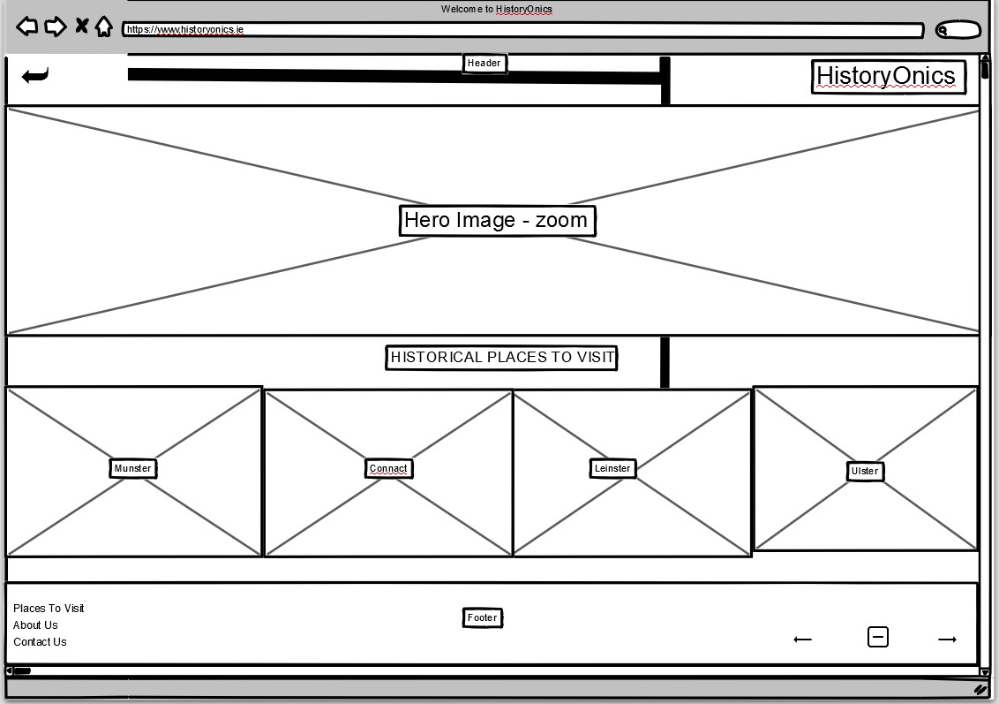

### Visit Page for wide screen devise
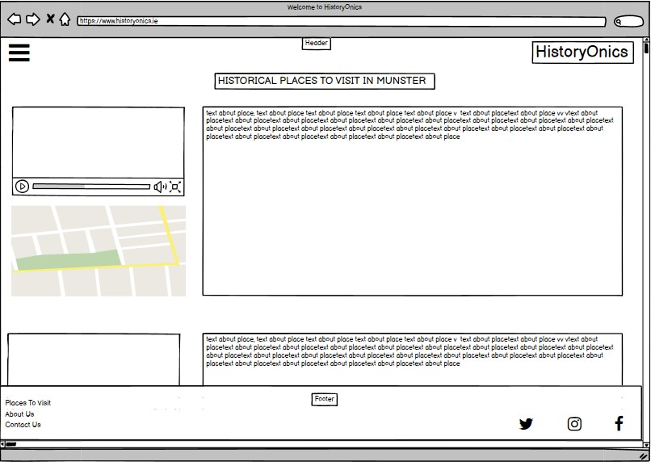

### About Us Page for wide screen devise
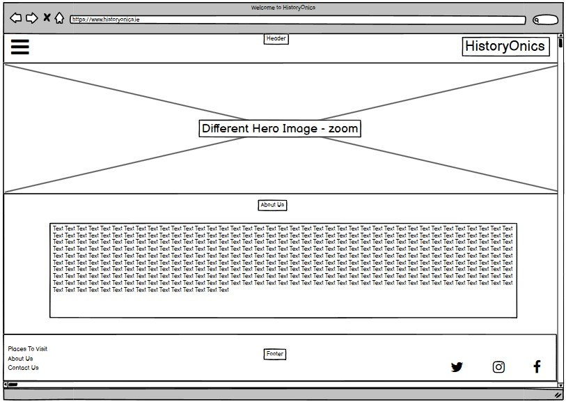

### Contact Page for wide screen devise

### Submit Page for wide screen devise
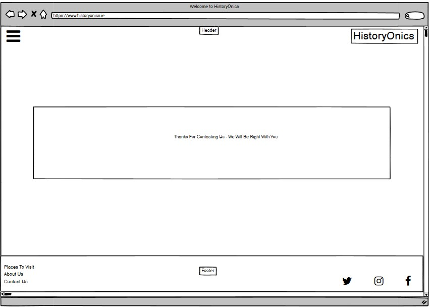

### Home Page for small screen devise
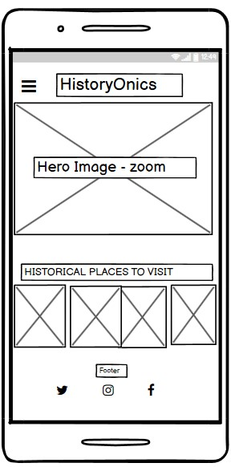

### Visit Page for small screen devise
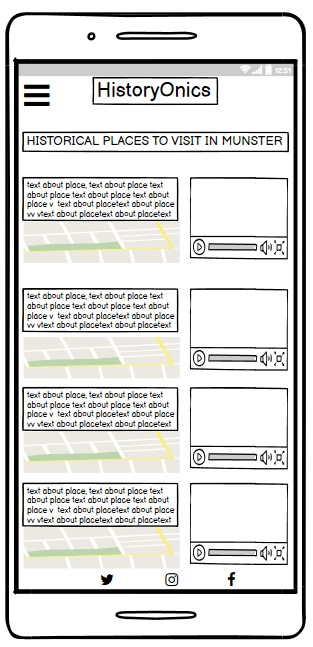

### About Us Page for small screen devise
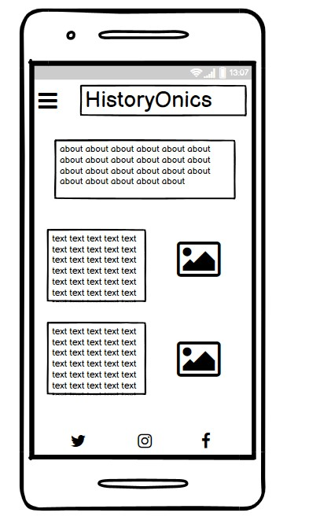

### Contact Page for small screen devise
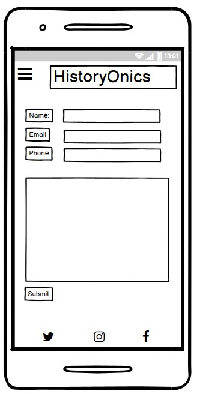

### Submit Page for small screen devise
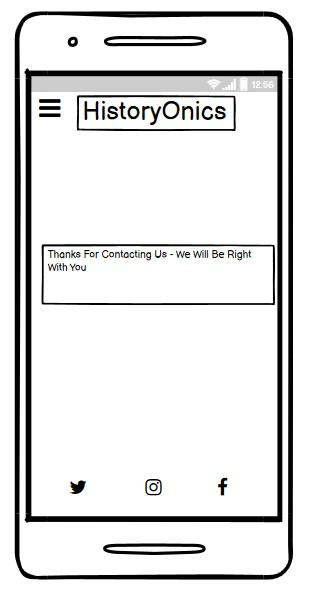

[Back to top](<#Table-of-Contents>)

# Structure of Site
The site is made up of eight pages. They are constructed of:
1. * [Home page](index.html)
2. * [Visit Munster page](munster.html)
3. * [Visit Connacht page](connacht.html)
4. * [Visit Leinster page](leinster.html)
5. * [Visit Ulster page](ulster.html)
6. * [About Us page](about.html)
7. * [Contact Us page](contact.html)
8. * [Submit page](submit.html)

The site opens with a landing page that presents a [Hero Image](./assets/images/hero-image.jpeg) with a zoom effect. For wide screens, there is a navigation menu on the top right-hand side. This turns into a hamburger bar for smaller screens and is placed on the left of the screen. The logo is also used as a navigational tool on each page to bring the user
back to the landing page. The nav bars are provided on each page, except the submission page, to guide the user and are responsive on all screen sizes.

The centre structure of the page provides a short introduction to the site. The heading used for this piece also incorporates fixed
icons of a person strolling, this is to complement the title 'A Stroll Back In Time'. 
At the bottom of the landing page is also another navigation block which is broken into four separate 
images with access to four separate pages. The images change colour to grayscale when hovered over to allow
the user to know which block they are choosing.
The footer holds the social media icons, which are responsive on all screens throughout each page of the site.

The visit pages provide a short intro to each county with a map and youtube video guide. 
The map can be clicked upon and opened to a new window. The videos each play within the existing site page.

The About Us page introduces the user to the team and provides a brief description and biography of the 
site owners. Images of the team have also been added to the page.

The contact page provides a query box and requires the user to complete various fields including
Name, Phone, and Email. These boxes are required fields and have a * to indicate this to the user.
The email address provided by the user must be correctly structured to submit a query.

The submission page appears after the user submits a query via the contact page. The page provides a message stating that the 
query has been received. The user can then navigate away from this page by clicking on the Logo or nav bar provided.

[Back to top](<#Table-of-Contents>)

# Typography
The body of the site uses font style "Lato", "sans-serif". This is in contrast with the logo and headings which
uses the font style "Cormorant SC", "sans-serif". Initially, Cormorant SC was used throughout as the style provides 
a more ancient feel to the historic site. However, this font appears only as uppercase and therefore the body was 
replaced with Lato typeface to provide a more natural read for the user. Sans-serif is in place as a secondary default option
should either of the first options fail. Fonts were taken from [Google Fonts](https://fonts.google.com/).

[Back to top](<#Table-of-Contents>)

# Colour Scheme

The colour scheme is inspired by the traditional color of Ireland, green. The shade #E2EECC was 
chosen as this colour is soft yet also provides a more ancient feel within a green tone.
The text is set as #2f4f4f, which again is in keeping with the green tones and historic feel of the site.
Grayscale has also been used when hovering over the navigational block of images at the bottom
of the landing page. To contrast against the green tone, #f1f1f1 has been used for the text on all navigation
bars and blocks. Finally, #45a049 has been used when hovering over the submit button on the contact page. 

For smaller devices, the colour scheme has changed to allow a better visual experience. The body background changes to #faebd7 
which provides a lighter background against the now #000000 text. The hamburger icon is now visible with #FF7F50 and upon opening
the menu, the background has changed to #d2691e. 

The colour scheme was guided by [Adobe Color](https://color.adobe.com/create/color-wheel) and [HTML CSS Color Picker](https://www.htmlcsscolor.com/).

# Desktop Colours:
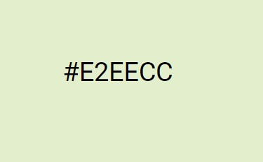
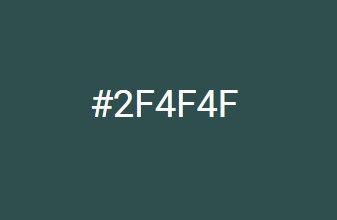
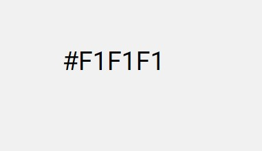
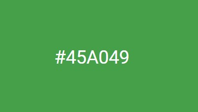

# Mobile Colours:
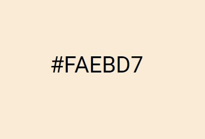
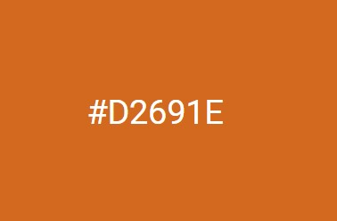
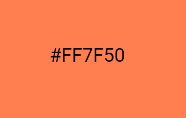
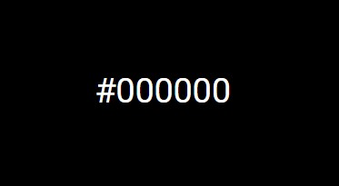

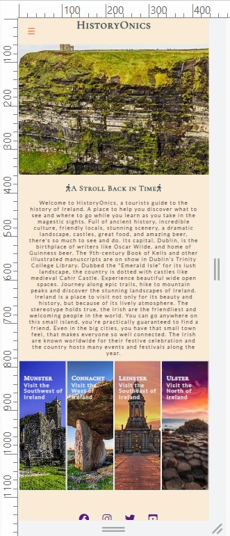
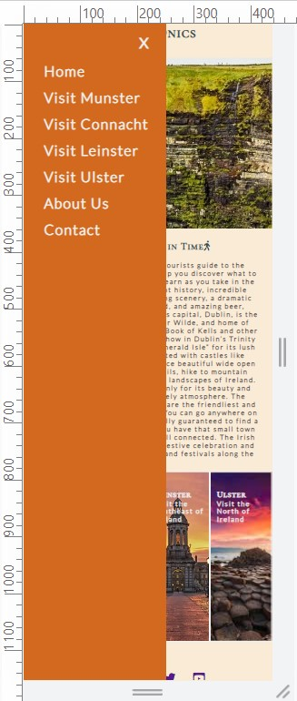
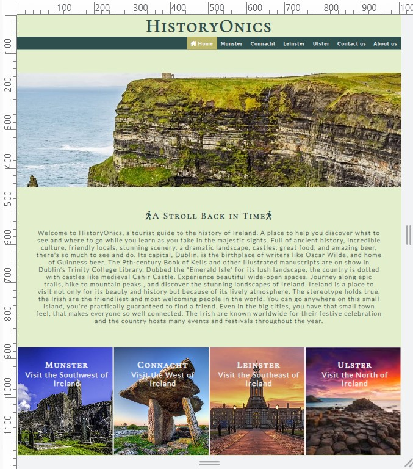

[Back to top](<#Table-of-Contents>)

# Existing Features

## Navigation Menu
A top navigation menu bar has been put in place for screens 950px and wider. Originally, a hamburger-bar
the menu was put in place for all screens, as this seems to be a common theme with other sites currently through further research, however, in order to show adaptability with building this site, the hamburger bar was set in place for screens smaller than 950px. This also shows the responsiveness as the screens are minimized. 
The top navigation menu bar sits at the top right-hand side of the screen and allows the user to navigate 
through seven pages (the eight-page being the submission button which cannot be accessed unless pressing 'submit' on the
contact page). Each element becomes highlighted as the user hovers over the tabs separately. This aspect was influenced
by the W3School via [W3School](https://www.w3schools.com/howto/howto_css_navbar_icon.asp)

Originally the Nav bar was quite plain and lacked style. Following some sound advice and suggestions via Peer-Code-Review on Slack, the Nav bar was changed to a more visually pleasant image for the user.

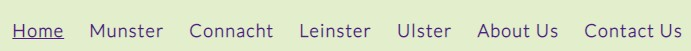

New Nav bar which runs across the full screen:

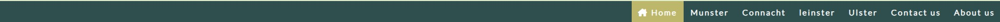

## Hamburger Bar

A hamburger bar has been placed for small screens including tablets and mobile devices. This button sits
at the top left-hand corner of the screen and provides the user with a full list of pages, as per the top navigation menu bar.
The icon can be recognized by the three lines visible, upon the user clicking on this, the button changes colour and opens to
provide a list of pages. The X on the open tab of the menu must then be clicked to close the hamburger bar. This aspect was
influenced by [W3School Collapsed Sidepanel](https://www.w3schools.com/howto/howto_js_collapse_sidepanel.asp).

 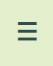
 

 
 

[Back to top](<#Table-of-Contents>)

## Logo

The logo 'HistoryOnics' is a play on words. Histrionic, meaning overly dramatic or theatrical.
is in keeping with the dramatic history and storytelling of Ireland. The font, "Cormorant SC" may
also be seen as dramatic, coupled together with colour #2f4f4f brings a bold effect, in keeping with
an Irish historical theme. Upon clicking on the logo, the user is brought back to the landing page.
The logo is responsive on all screens.

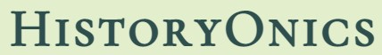

[Back to top](<#Table-of-Contents>)

## Hero Image
The [Hero Image](./assets/images/hero-image.jpeg) is of the Cliffs of Moher and is synonymous with Ireland across the globe and presents an immediate interaction with the user with the zoom-in effect. The zoom-in effect is responsive to all wide-screen sizes. The Hero Image was sourced via [Google Images](https://images.google.com/) from [Cliffs of Moher](https://www.cliffsofmoher.ie/unesco-global-geopark/education/learning-resources/).

[Back to top](<#Table-of-Contents>)

## Navigation Blocks

The navigational block is provided for further interaction with the user. The user can hover over each image, which will then become grayscale, and upon clicking on the chosen box, the user will be directed to the chosen page. Famous aspects of each province have been used for imagery with bright colours to further attract the user visually. This block is responsive to all screens.Images are sourced via [Google Images](https://images.google.com/) via: [Connacht Image](https://theplanetd.com/poulnabrone-dolmen-ireland/), [Munster Image](https://www.atlanticwaytouring.com/product/quin-abbey/), [Leinster Image](https://www.meetingselect.com/en/venue/trinity-college-university-of-dublin), [Ulster Image](https://www.posterlounge.com/p/738259.html)

 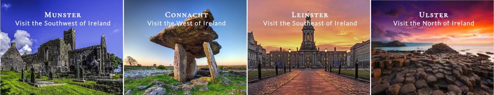

 [Back to top](<#Table-of-Contents>)

## Social Media
The social media icons can be accessed on all pages and will bring the user to four separate external sites
including [Twitter](https://twitter.com/), [Instagram](https://www.instagram.com/?hl=en), [Facebook](https://www.facebook.com/) and [Youtube](https://www.youtube.com/). The setting of these icons has been influenced by the Love Running module
as per [Code Institute](https://codeinstitute.net/ie/). Icons were accessed by [Font Awesome](https://fontawesome.com/icons).

[Back to top](<#Table-of-Contents>)

## Videos

Videos have been incorporated as part of the Visit Pages for each county within Provinces. All video material has been sourced 
via Youtube. Each video provides information as per the county it is relating to. The videos were originaly 
to be placed on the left-hand side of the page, however, this was not as visually appealing as when it is placed on the right. 
Each video is responsive on all screens and will play within the page, without increasing in size. 
Videos are sourced from:

* [Youtube - County By County Show](https://www.youtube.com/results?sp=mAEB&search_query=county+by+county+ireland+show)
* [Youtube - The Heart of Ireland](https://www.youtube.com/embed/2dWYJkQlDg0)
* [Youtube - Kerry by a Local](https://www.youtube.com/embed/zDWJL6rLnes)
* [Youtube - Galway City](https://www.youtube.com/embed/ocJPdvALnow)
* [Youtube - Mayos Historic Houses](https://www.youtube.com/embed/Kyl4NpYWAKs)
* [Youtube - Epic Dublin](https://www.youtube.com/embed/hO14hhzAaeo)
* [Youtube - Carlow Hidden Gems](https://www.youtube.com/embed/ehl1dCF3cuA)
* [Youtube - The Fall of the House of Kildare](https://www.youtube.com/embed/P5pLGLF4Km4)
* [Youtube - Kilkenny](https://www.youtube.com/embed/tIKix6WE-4k)
* [Youtube - Cork Military History](https://www.youtube.com/embed/wLfCrP9fGps)
* [Youtube - County Louth](https://www.youtube.com/embed/F842XAZCo30)
* [Youtube - Donegal Tourism](https://www.youtube.com/embed/Lo81SEn13Kg)
* [Youtube - Visit Cavan](https://www.youtube.com/embed/P_IsHs0PZUY)
* [Youtube - Antrim Coast](https://www.youtube.com/embed/0h3cYy9Dw2M)
* [Youtube - Tyrone](https://www.youtube.com/embed/oWakocgKgWg)
* [Youtube - Flavour of Ireland](https://www.youtube.com/embed/psRBvZtDkfc)
* [Youtube - Pocket History of Londonderry](https://www.youtube.com/embed/ykWLGa5XrIs)

[Back to top](<#Table-of-Contents>)

## Maps

Maps have been incorporated onto each Visit Page, under each county separately. The maps are responsive on
all screens, however, must be clicked within the middle of the map for small mobile devices (eg. iPhone 5). Otherwise, all 
maps will open and respond to 'View Larger Map' where indicated on the map. Maps will also be responsive when clicked anywhere
on the map for all screens. Maps are sourced by accessing:

* [Google Maps](https://www.google.com/maps/@52.8603236,-9.6709686,9z)

[Back to top](<#Table-of-Contents>)

## Contact Us
The contact page is a simple structure that allows the user to provide required and non-required information. 
The required elements are indicated by * after the element name. This includes First Name, Last Name, and Email.
The phone and query box are not set as required. The email element must be correctly formatted to be accepted.
The query box is the only aspect that has a placeholder to provide further instruction to the user. This page is
accessible via the navigation menu on a wide screen and Hamburger Bar via a smaller device.

[Back to top](<#Table-of-Contents>)

## Form Submission
The form submission page is presented upon the user submitting a query via the contact page. This page has access to a navigational menu/hamburger bar and Logo which will bring the user back to previous pages of the site. A message is in place acknowledging receipt of the query. A submit button is also in place to allow the user to bring them back to the home page.

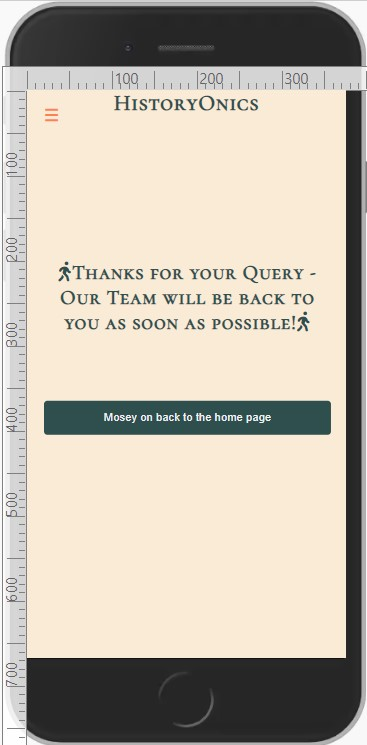
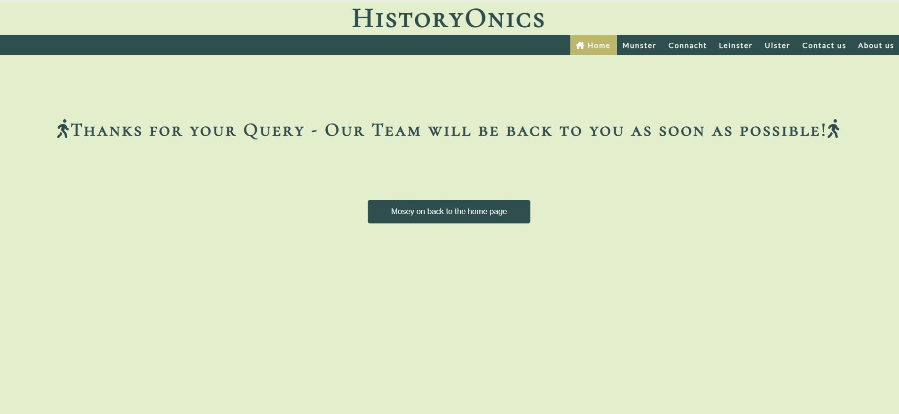

[Back to top](<#Table-of-Contents>)

## About Us

The About Us page provides information about how the site was established in the opening paragraph. This paragraph was 
created using a text creator via [volusion.com](https://www.volusion.com/) 
Below the opening paragraph, there is a Meet the Team. This aspect provides a brief description of the team and provides images of the team members. Public domain images are sourced via [pxhere.com](https://pxhere.com/)

[Back to top](<#Table-of-Contents>)

## Footer
The footer appears at the bottom of each page. The social media icons are centered within the footer and can be 
clicked on to interact with. 

[Back to top](<#Table-of-Contents>)

## Future Features
- An e-commerce element would be included where the user can book a specific tour per province. The tours would be broken up into bus and bicycle tours.
- A page dedicated to where users can find the best pubs/restaurants off the beaten track and away from the tourist traps.
- An e-commerce element that sells experiences, eg. spending an afternoon cooking traditional food in a hosting kitchen.

[Back to top](<#Table-of-Contents>)

## Technologies Used
  * [HTML](https://en.wikipedia.org/wiki/HTML5) - HTML the most basic building block of the Web. This is the main language used to develop the site. 
  * [CSS](https://en.wikipedia.org/wiki/CSS) - CSS describes how HTML elements are to be displayed on screen. This has been used to develop the style of the site.
  * [Java Script](https://en.wikipedia.org/wiki/JavaScript) - JavaScript was used to construct the hamburger bar.
  * [Google Fonts](https://fonts.google.com/) - Google Fonts is a directory of font families which was incorporated during the development of the site.
  * [Font Awesome Icons](https://fontawesome.com/icons) - Font Awesome is a directory of icons that were used to incorporate icons for social media, text, and headings.
  * [balsamiq](https://balsamiq.com/wireframes/?gclid=CjwKCAjwi8iXBhBeEiwAKbUoferdHodwIX8rhZQq6jDFB9i1ffpeC04Iv0ROTwgZLHrOEP1rmCqzjhoCUsMQAvD_BwE) - Balsamiq was used to create a mock-up wireframe for large and small screen devices.
  * [GitHub](https://github.com/about) - Github is used to host the source code for the site.
  * [Git](https://git-scm.com/) - Git is used to manage and keep track of the source code history throughout development. 
  * [Gitpod](https://www.gitpod.io/) - Gitpod creates connections between Gitpod and GitHub accounts. Gitpod continuously builds git branches to facilitate the coding process.
  * [Adobe Color](https://color.adobe.com/create/color-wheel) - Adobe Colour has been used to navigate colour charts for the site during development.
  * [Gimp](https://www.gimp.org/) - Gimp was used to edit and resize images before loading to the site. 
  * [Slack](https://slack.com/intl/en-ie/) - Slack was utilized by seeking advice and knowledge from students and mentors.
  * [Visual Studio](https://visualstudio.microsoft.com/) - Visual Studio was used in the very early phase to gain further understanding of how to properly implement code while gaining confidence with Github.
  * [volusion](https://www.volusion.com/) - Volusion is a site which drafts copy for paragraphs. 
  * [pxhere](https://pxhere.com/) - Pxhere was used to source images for the About Us page.
  * [Google Maps](https://www.google.com/maps/@52.8603236,-9.6709686,9z) - Google Maps was used to source the map links for each visit page.
  * [Youtube](https://www.youtube.com/) - Youtube was the source for each video on the Visit Pages.
  * [Code Institute](https://codeinstitute.net/ie/) - Influence with the styling of the landing page was taken from the Love Running module available via the Programme Overview.
  * [Google Images](https://images.google.com/) - Google Images provided images for the Hero Image and Navigation block on the landing page.
  * [HTML CSS Color Picker](https://www.htmlcsscolor) - This site was accessed to assist with defining colour.
  * [Grammarly](https://app.grammarly.com/) - This site was used to complete a spell check throughout the site and readme file.

[Back to top](<#Table-of-Contents>) 
 
## Testing
- [Lighthouse](https://chrome.google.com/webstore/detail/lighthouse/blipmdconlkpinefehnmjammfjpmpbjk?hl=en)
- [WebPageTest](https://www.webpagetest.org/)
- [W3Markup Validation Service](https://validator.w3.org/)
- [W3CSS Validation Service](https://jigsaw.w3.org/css-validator/)

## W3 Validation Results:
* Home Page html - [Error Free Home Page](./assets/images/documentation/error-free-home-html.jpg)
* Munster Page html - [Error Free Munster Page](./assets/images/documentation/error-free-munster-html.jpg)
* Leinster Page html - [Error Free Leinster Page](./assets/images/documentation/error-free-leinster-html.jpg)
* Connacht Page html - [Error Free Connacht Page](./assets/images/documentation/error-free-connacht-html.jpg)
* Ulster Page html - [Error Free Ulster Page](./assets/images/documentation/error-free-ulster-html.jpg)
* About Page html - [Error Free About Us Page](./assets/images/documentation/error-free-about-html.jpg)
* Submit Page html - [Error Free Submit Page](./assets/images/documentation/error-free-submit-html.jpg)
* Contact Page html - [Error Free Contact Page](./assets/images/documentation/error-free-contact-html.jpg)
* CSS - [Error Free CSS](./assets/images/documentation/error-free-css.jpg)

## Lighthouse Testing Desktop Results:
* Home Page Html - [Lighthouse Validation Home Page](./assets/images/documentation/lighthouse-desktop-landingpage.jpg)
* Munster Page Html - [Lighthouse Validation Munster Page](./assets/images/documentation/lighthouse-desktop-munsterpage.jpg)
* Leinster Page html - [Lighthouse Validation Leinster Page](./assets/images/documentation/lighthouse-desktop-leinsterpage.jpg)
* Connacht Page html - [Lighthouse Validation Connacht Page](./assets/images/documentation/lighthouse-desktop-connachtpage.jpg)
* Ulster Page html - [Lighthouse Validation Ulster Page](./assets/images/documentation/lighthouse-desktop-ulsterpage.jpg)
* About Page html - [Lighthouse Validation About Us Page](./assets/images/documentation/lighthouse-desktop-aboutpage.jpg)
* Contact Page html - [Lighthouse Validation Contact Page](./assets/images/documentation/lighthouse-desktop-contactpage.jpg)

## Lighthouse Testing Mobile Results:
* Home Page html - [Lighthouse Validation Home Page](./assets/images/documentation/lighthouse-mobile-landingpage.jpg)
* Munster Page html - [Lighthouse Validation Munster Page](./assets/images/documentation/lighthouse-mobile-munsterpage.jpg)
* Leinster Page html - [Lighthouse Validation Leinster Page](./assets/images/documentation/lighthouse-mobile-leinsterpage.jpg)
* Connacht Page html - [Lighthouse Validation Connacht Page](./assets/images/documentation/lighthouse-mobile-connachtpage.jpg)
* Ulster Page html - [Lighthouse Validation Ulster Page](./assets/images/documentation/lighthouse-mobile-ulsterpage.jpg)
* About Page html - [Lighthouse Validation About Us Page](./assets/images/documentation/lighthouse-mobile-aboutpage.jpg)
* Contact Page html - [Lighthouse Validation Contact Page](./assets/images/documentation/lighthouse-mobile-contactpage.jpg)

## Webpagetest
* Results - Passed
* This test had a reasonably quick first-byte time.
* Zero render-blocking CSS files found.
* Zero custom fonts load in ways that delay text visibility.
* Zero Accessibility Issues were Detected.
* Zero render-blocking third-party requests found.
* Zero security vulnerabilities were detected by Snyk.
* Zero resources were found that were loaded over an insecure connection.

Chrome - The site posed no issues when accessing Chrome.
Firefox - The site posed no issues when accessing Firefox, however, upon accessing the submission page, one of the walking icons
moves under the text as opposed to remaining beside it.

[Back to top](<#Table-of-Contents>)

## Bugs and Errors
1. The ALT text adds a text description to an image on a Web page, and should be used for all images, graphical bullets, and graphical horizontal rules. Initially, Alt was included in the video and map iframe, however, this brought the Lighthouse Validation score down and created errors within W3 Validator. Once this was removed, the score increased and W3 stated error free.

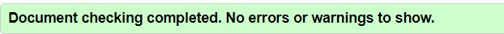

2. Upon adding the back button on the submit page, the button became cut off when resizing to a smaller devise:

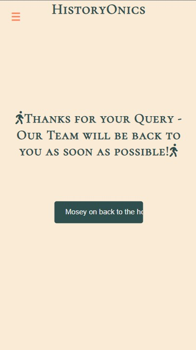

Issue was corrected by re-using the css for the contact page submit button:

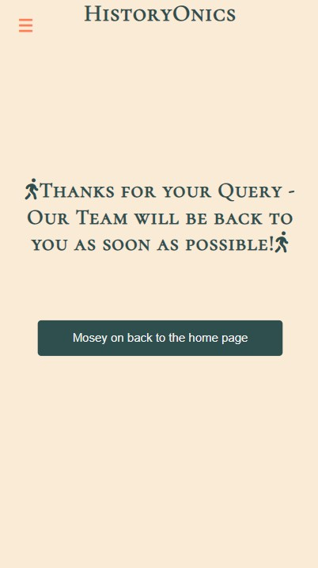

3. When validating the Visit pages on Lighthouse, errors appeared for all iframes. It was noted that height and width 
were set as a percentage and were coming up as an error. The height and width were changed to " " which solved the immediate issue. This then caused an issue with the map overlapping with the video upon decreasing the screen size. This issue was fixed by reducing the size of the map and video for a smoother transition when resizing.

 [Back to top](<#Table-of-Contents>)

## Deployment
1. Access *[Github](https://github.com/)* by signing into an account
2. Access the Repository on the top-right-hand corner of the screen
3. Select the Repository required from the list
4. Click 'Settings' on the menu tab
5. On the left-hand-side of the next page, click 'Pages'
6. Under source, select branch: main, folder: root, and then click save. 
7. Once saved, the site will take time to refresh while it goes public. 
8. A link will appear stating (eg. of my account): Your site is live at https://toby7658.github.io/History-Onics/

## **Forking the GitHub Repository **
By forking the GitHub Repository, a copy of the repository can be viewed or amended without affecting the original repository.
1. Log into GitHub to access the GitHub Repository,
2. At the top-right-hand side of the screen, locate "Fork",
3. Click on the "Fork" tab,
4. You now have a copy of the original repository in your GitHub account.

## ** Cloning the Github Repository **
1. Log into GitHub to access the GitHub Repository,
2. Under the settings button, click on the tab "Code",
3. This will open a dropdown box,
4. To clone using HTTPS, copy the link provided under this tab,
5. Access the desired IDE (eg. Visual Studio),
6. Type git clone, followed by the copied URL,
7. Press enter - this has now create your clone in the desired IDE.

[Back to top](<#Table-of-Contents>)

## Credits

* Mentor support and guidance from *[Jack Wachira](https://github.com/iamjackwachira)*.
* Readme support and guidance from *[Michael McCarthy](https://github.com/mickymacirl)*
* Peer-code-review from *[Harry Dhillon](https://github.com/Harry-Leepz)*.
* Facilitator and support from *[Kenan Wright](https://github.com/KenanCarlWright/KenanCarlWright)*.
* Facilitator and support from *[Kasia Bogucka](https://github.com/bezebee)*.
* W3C School Collapse Sidepanel *[W3C School Collapse Sidepanel](https://www.w3schools.com/howto/howto_js_collapse_sidepanel.asp)* - This assisted with developing the Hamburgerbar sidepanel.
* W3C School Contact Form *[W3C School Contact Form](https://www.w3schools.com/howto/howto_css_contact_form.asp)* - This assisted with developing the Contact Box on the Contact Us page.
* W3C School About Us Page *[W3C School About Us](https://www.w3schools.com/howto/howto_css_about_page.asp)* - This assisted with developing the About Us page.
* W3C School CSS Tutorial *[W3C School CSS Tutorial](https://www.w3schools.com/css/)* - Used for additional learning around the over-all basics of CSS.
* W3C School Hamburger Bar Icon *[W3C School Hamburger Bar Icon](https://www.w3schools.com/howto/howto_css_menu_icon.asp)* - This assisted with developing the Hamburger Bar Icon.
* W3C School Hamburger Bar side panel *[W3C School Hamburger Bar sidepanel](https://www.w3schools.com/howto/howto_js_collapse_sidepanel.asp)* - This assisted with developing the Hamburger Bar side panel.
* W3C School Hover *[W3C School Hover](https://www.w3schools.com/cssref/sel_hover.asp)* - This assisted with creating hover interaction when mouse-over menus.
* W3C School Hover to grayscale *[W3C School Hover-Effects](https://www.w3schools.com/w3css/w3css_effects.asp)* - This assisted with creating hover with greyscale effects for the province block.
* Linuxhint *[Linuxhint](https://linuxhint.com/html-meta-tag/)* - This assisted with gaining further knowledge around meta tags.
* Navigation Menu *[Love Running](https://codeinstitute.net/ie/)* - This element was influenced by the Love Running module tutorial.
* Markdown Guide *[Markdown Guide](https://www.markdownguide.org/basic-syntax/)* - This was used to understand the basic syntax for Markdown.
* Youtube *[Youtube - County By County Show](https://www.youtube.com/results?sp=mAEB&search_query=county+by+county+ireland+show)* - Videos for each county are sourced via Youtube.
* Youtube *[Youtube - The Heart of Ireland](https://www.youtube.com/embed/2dWYJkQlDg0)* - Videos for each county is sourced via Youtube.
* Youtube *[Youtube - Kerry by a Local](https://www.youtube.com/embed/zDWJL6rLnes)* - Videos for each county is sourced via Youtube.
* Youtube *[Youtube - Galway City](https://www.youtube.com/embed/ocJPdvALnow)* - Videos for each county is sourced via Youtube.
* Youtube *[Youtube - Mayos Historic Houses](https://www.youtube.com/embed/Kyl4NpYWAKs)* - Videos for each county are sourced via Youtube.
* Youtube *[Youtube - Epic Dublin](https://www.youtube.com/embed/hO14hhzAaeo)* - Videos for each county is sourced via Youtube.
* Youtube *[Youtube - Carlow Hidden Gems](https://www.youtube.com/embed/ehl1dCF3cuA)* - Videos for each county are sourced via Youtube.
* Youtube *[Youtube - The Fall of the House of Kildare](https://www.youtube.com/embed/P5pLGLF4Km4)* - Videos for each county are sourced via Youtube.
* Youtube *[Youtube - Kilkenny](https://www.youtube.com/embed/tIKix6WE-4k)* - Videos for each county is sourced via Youtube.
* Youtube *[Youtube - Cork Military History](https://www.youtube.com/embed/wLfCrP9fGps)* - Videos for each county is sourced via Youtube.
* Youtube *[Youtube - County Louth](https://www.youtube.com/embed/F842XAZCo30)* - Videos for each county is sourced via Youtube.
* Youtube *[Youtube - Donegal Tourism](https://www.youtube.com/embed/Lo81SEn13Kg)* - Videos for each county is sourced via Youtube.
* Youtube *[Youtube - Visit Cavan](https://www.youtube.com/embed/P_IsHs0PZUY)* - Videos for each county is sourced via Youtube.
* Youtube *[Youtube - Antrim Coast](https://www.youtube.com/embed/0h3cYy9Dw2M)* - Videos for each county is sourced via Youtube.
* Youtube *[Youtube - Tyrone](https://www.youtube.com/embed/oWakocgKgWg)* - Videos for each county is sourced via Youtube.
* Youtube *[Youtube - Flavour of Ireland](https://www.youtube.com/embed/psRBvZtDkfc)* - Videos for each county are sourced via Youtube.
* Youtube *[Youtube - Pocket History of Londonderry](https://www.youtube.com/embed/ykWLGa5XrIs)* - Videos for each county are sourced via Youtube.
* Hero Image *[Google Images](https://images.google.com/)* - Image sourced via Google Images and originated via *[Cliffs of Moher](https://www.cliffsofmoher.ie/)*.
* Munster Image *[Google Images](https://images.google.com/)* - Image sourced via Google Images and originated via *[Atlantic Way Touring](https://www.atlanticwaytouring.com/product/quin-abbey//)*
* Connacht Image *[Google Images](https://images.google.com/)* - Image was sources via Google Images and originated via *[The Planet](https://theplanetd.com/poulnabrone-dolmen-ireland/)*.
* Leinster Image *[Google Images](https://images.google.com/)* - Image was sources via Google Images and originated via *[Meeting Select](https://www.meetingselect.com/en/venue/trinity-college-university-of-dublin/)*.
* Ulster Image *[Google Images](https://images.google.com/)* - Image was sources via Google Images and originated via *[Poster Lounge](https://www.posterlounge.com/p/738259.html)*.
* Github *[Github Markdown Cheatsheet](https://github.com/adam-p/markdown-here/wiki/Markdown-Cheatsheet)* - This information assisted with understanding the syntax of Markdown.
* Landing Page paragraph *[Power Trip](https://powertripshow.com/location/ireland/)* - Paragraph was taken and added to Landing Page introduction.
* Landing Page paragraph *[Interview Area](https://www.interviewarea.com/faq/do-people-love-ireland)* - Two sentences taken and added to Landing Page introduction.
* Volusion *[Volusion](https://www.volusion.com/)* - This was used to help create an introductory paragraph for the Landing Page.

### The following links will bring you to the original source for text used throughout the site: 

## Munster Paragraphs
* Clare: *[Atlantic Way Touring](https://www.atlanticwaytouring.com/product-category/clare/)*, 
  Tipperary: *[XWhos](https://www.xwhos.com/place_of_birth/1/county_tipperary.html)*, 
  Limerick: *[Embark](https://www.embark.org/ireland/limerick)*, 
  Waterford: *[Thin Line](https://www.thinline.ie/product-page/waterford)*, 
  Cork: *[Atlantic Way Touring](https://www.atlanticwaytouring.com/product-category/cork/)*, 
  Kerry: *[Atlantic Way Touring](https://www.atlanticwaytouring.com/product-category/kerry/)*. 

## Connacht Paragraphs
* Galway: *[Atlantic Way Touring](https://www.atlanticwaytouring.com/product-category/galway/)*, 
  Leitrim: *[Love to Visit](https://lovetovisitshop.com/blogs/news/county-leitrim-ireland-things-to-see-and-do)*, 
  Mayo: *[Atlantic Way Touring](https://www.atlanticwaytouring.com/product-category/mayo/)*, 
  Roscommon: *[Rosclay Pottery](https://rosclaypottery.com/things-to-do-in-roscommon/)*, 
  Sligo: *[Irish Hotel Breaks](https://irishhotelbreaks.ie/hotel-breaks-sligo/)*.

## Leinster Paragraphs
* Dublin: *[My World Travel](https://myworldtravelco.com/product/dublin-destination-dossier/)*, 
  Carlow: *[Wikipedia](https://en.wikipedia.org/wiki/County_Carlow)*,
  Kildare: *[Love to Visit](https://lovetovisitshop.com/blogs/news/tagged/county-kildare-ireland-things-to-see-and-do)*,
  Kilkenny: *[Love to Visit](https://lovetovisitireland.com/county-kilkenny-ireland-things-to-see-and-do/)*,
  Laois: *[Wikipedia](https://en.wikipedia.org/wiki/County_Laois)*,
  Longford: *[Discovering Ireland](https://www.discoveringireland.com/longford/)*,
  Louth: *[Discovering Ireland](https://www.discoveringireland.com/louth/)*,
  Meath: *[Love to Visit](https://lovetovisitireland.com/county-meath-ireland-things-to-see-and-do/)*,
  Offaly: *[Go to Ireland](https://www.gotoireland.today/county-offaly.html)*,
  Wicklow: *[Izaskun lekue](https://izaskunlekue.wordpress.com/)*,

## Ulster Paragraphs
* Donegal: *[Harveys Point](https://www.harveyspoint.com/discover-donegal.html)*,
  Cavan: *[Roots Ireland](https://www.rootsireland.ie/cavan-genealogy/about-cavan/)*,
  Monaghan: *[Sweat Lodge Radio](https://www.sweatlodgeradio.com/why-is-monaghan-called-monaghan/)*,
  Antrim: *[Discover Northern Ireland](https://discovernorthernireland.com/blog/county-antrim)*,
  Down: *[Connolly Cove](https://www.connollycove.com/county-down/)*,
  Tyrone: *[Wikipedia](https://en.wikipedia.org/wiki/County_Tyrone)*,
  Fermanagh: *[Irish Central](https://www.irishcentral.com/roots/genealogy/county-fermanagh)*
  Derry: *[Irish Central](https://www.irishcentral.com/travel/county-derry)*
  Armagh: *[Wikipedia](https://en.wikipedia.org/wiki/Armagh)*

 [Back to top](<#Table-of-Contents>)

## Code Used
 * [HTML](https://en.wikipedia.org/wiki/HTML5)
 * [CSS](https://en.wikipedia.org/wiki/CSS)
 * [Java Script](https://en.wikipedia.org/wiki/JavaScript)

 [Back to top](<#Table-of-Contents>)

## Acknowledgment
Many thanks to my Mentor *[Jack Wachira](https://github.com/iamjackwachira)* for providing solid guidance
and support. Thanks to Code Institute for giving me such an amazing opportunity to develop a new career
in such a supportive environment. Thanks to the community on Slack who are an ongoing wealth of information and motivation. 

[Back to top](<#Table-of-Contents>)