# **_HistoryOnics_**

HistoryOnics is a tourist history website which focuses on each provence of Ireland. 
The site aims to provide information about Irelands history and interesting places 
to visit for both local and international tourists.The site provides maps and videos 
of each county, within each provence and links to social media for users to interact 
with the site. The User can also contact the site should they have more queries. 

Link to live site - [HistoryOnics](https://toby7658.github.io/History-Onics/)

# Table of Contents

* [**User Experience UX**](<#user-experience-ux>)
    * [Wireframe](<#wireframe>)
    * [Structure of Site](<#structure-of-site>)
    * [Typography](<#typography>)
    * [Colour Scheme](<#colour-scheme>)

* [**Existing Features**](<#existing-features>)
    * [Navigation Menu](<#navigation-menu>)
    * [Hamburger Bar](<#hamburger-bar>)
    * [Logo](<#logo>)
    * [Hero Image](<#hero-image>)
    * [Navigation Blocks](<#navigation-blocks>)
    * [Social Media](<#social-media>)
    * [Videos](<#videos>)
    * [Maps](<#maps>)
    * [Contact Us](<#contact-us>)
    * [Form Submission](<#form-submission>)
    * [About Us](<#about-us>)
    * [Footer](<#footer>)

* [**Future Features**](<#future-features>)

* [**Technologies Used**](<#technologies-used>)
  * [HTML](#html)
  * [CSS](#css)
  * [Google Fonts](#google-fonts)
  * [Font Awesome Icons](#font-awesome-icons)
  * [balsamiq](#balsamiq)
  * [GitHub](#github)
  * [Adobe Color](#adobe-Color)
  * [Gimp](#gimp)
 

* [**Testing**](<#testing>)

- [Lighthouse Testing](#lighthouse-testing)
- [W3c](#https://jigsaw.w3.org/css-validator/)

* [**Deployment**](<#deployment>)

* [**Credits**](<#credits>)

* [**Code Used**](<#code-used>)
  * [HTML](#html)
  * [CSS](#css)
  * [JAVA SCRIPT](#java-script)

* [**Acknowledgment**](<#Acknowledgment>)

# User Experience UX
## Wireframe
The mock-up for this project was created using [Balsamiq](https://balsamiq.com/wireframes/).
Aspects of the mock-up have changed during production due to increasing user experience and 
visual effects. Changes include moving the Logo to the centre and creating a Nav menu bar
which is replaced by a Hamburger bar as devices become smaller.

### Home Page for wide screen devise
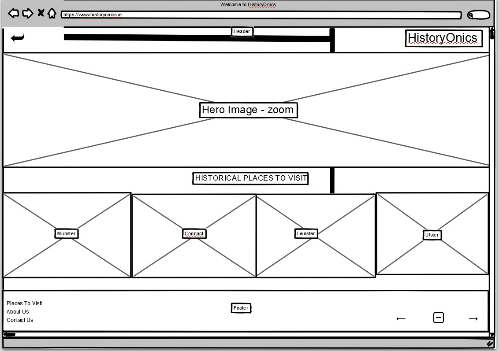

### Visit Page for wide screen devise
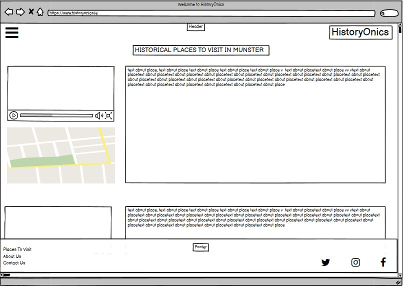

### About Us Page for wide screen devise
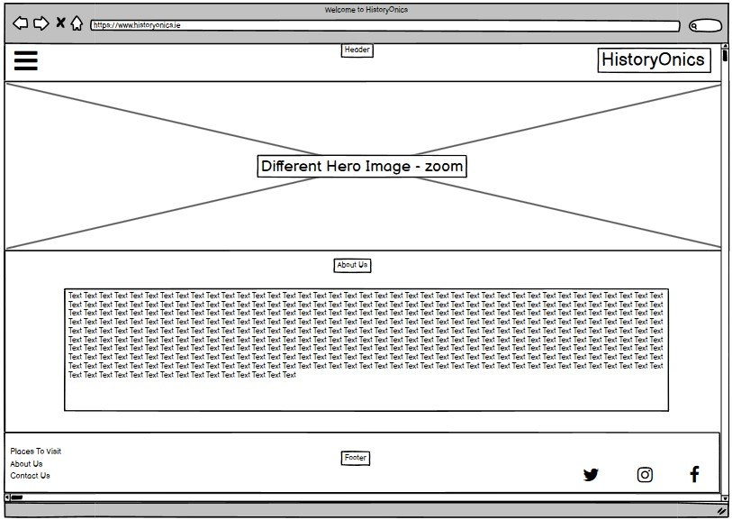

### Contact Page for wide screen devise
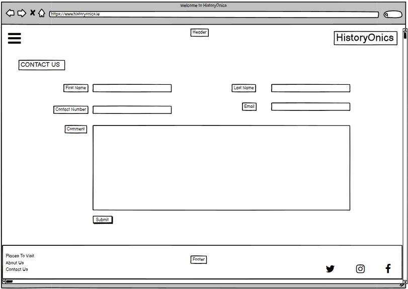

### Submit Page for wide screen devise
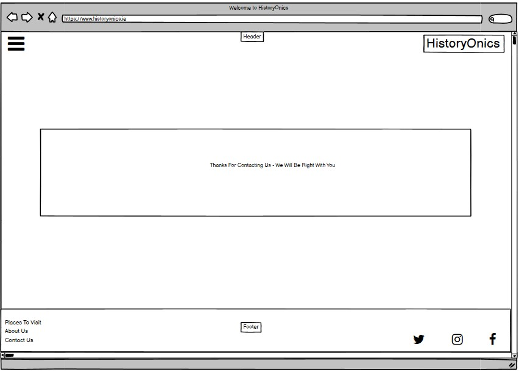

### Home Page for small screen devise
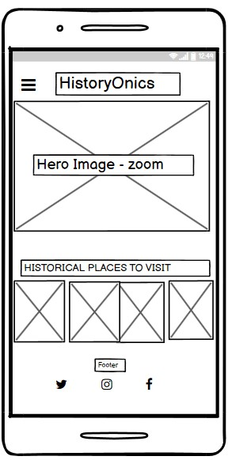

### Visit Page for small screen devise
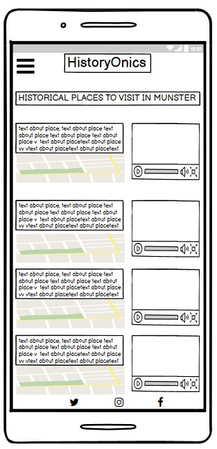

### About Us Page for small screen devise
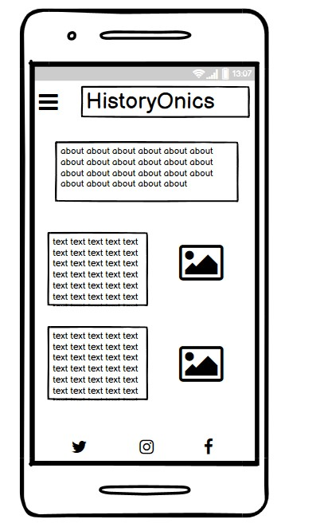

### Contact Page for small screen devise
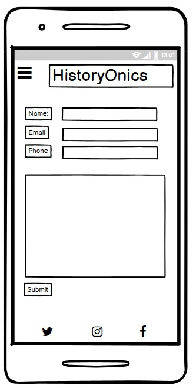

### Submit Page for small screen devise
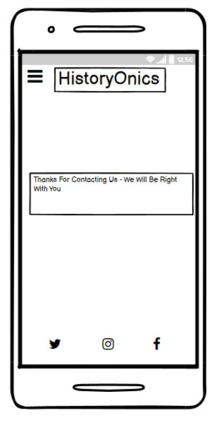

[Back to top](<#Table of Contents>)

# Structure of Site
The site is made up of eight pages. They are constructed of:
1. * [Home page](index.html)
2. * [Visit Munster page](munster.html)
3. * [Visit Connacht page](connacht.html)
4. * [Visit Leinster page](leinster.html)
5. * [Visit Ulster page](ulster.html)
6. * [About Us page](about.html)
7. * [Contact Us page](contact.html)
8. * [Submit page](submit.html)

The site opens with a landing page which presents a [Hero Image](./assets/images/hero-image.jpeg) with zoom effect. 
For wide screens, there is a navigation menu at the top right hand side. This turns into a hamburger-bar for smaller screens and is placed on the left of the screen. The logo is also used as a navigational tool on each page to bring the user
back to the landing page. The nav bars are provided on each page to guide the user and are responsive on all screen sizes.

The centre structure of the page provides a short introduction to the site. The heading used for this piece also incorporates fixed
icons of a person strolling, this is to complement the tatle 'A Stroll Back In Time'. 
At the bottom of the landing page is also another navigation block which is broken into four seperate 
images with access to four seperate pages. The images change colour to grayscale when hovered over to allow
the user to know which block they are choosing.
The footer holds the social media icons, which are responsive on all screens throughout each page of the site.

The visit pages provides a short intro to each county with a map and youtube video guide. 
The map can be clicked upon and opens to a new window. The videos each play within the existing site page.

The About Us page introduces the user to the team and provides a brief description and biography of the 
site owners. Images of the team have also been added to the page.

The contact page provides a query box and requires the user to complete various fields including
Name, Phone and Email. These boxes are required fields and have a * to indicate this to the user.
The email address provided by the user must be correctly structured inorder to submit a query.

The submission page appears after the user submits a query via the contact page. The page provides a message stating that the 
query has been received. The user can then navigate away from this page by clicking on the Logo or nav bar provided.

[Back to top](<#Table of Contents>)

# Typography
The body of the site uses font style "Lato", "sans-serif". This is in contrast with the logo and headings which
uses font style "Cormorant SC", "sans-serif". Initially, Cormorant SC was used throughout as the style provides 
a more ancient feel to the history site. However, this font appears only as uppercase and therefore the body was 
replaced with Lato typeface to provide a more natural read for the user. Sans-serif is inplace as a secondary default option
should either of the first options fail. Fonts were taken from [Google Fonts](https://fonts.google.com/).

[Back to top](<#Table of Contents>)

# Colour Scheme

The colour scheme is inspired by the traditional color of Ireland, green. The shade "rgb(226, 238, 204)" was 
chosen as this colour is soft yet also provides a more ancient feel within a green tone.
The text is set as #2f4f4f, which again is inkeeping with the green tones and historic feel of the site.
Grayscale has also been used when hovering over the navigational block of images at the bottom
of the landing page. To contrast against the green tone, #f1f1f1 has been used for the text on all navigation
bars and blocks. Finally, #45a049 has been used when hovering over the submit button on the contact page. 
The colour scheme was guided by [Adobe Color](https://color.adobe.com/create/color-wheel).

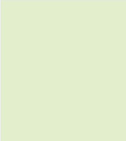
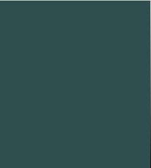
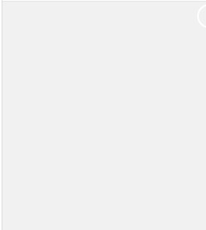
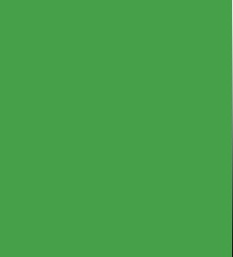

[Back to top](<#Table of Contents>)

# Existing Features

## Navigation Menu
A top navigation menu bar has been put in place for screens 950px and wider. Originally, a hamburger-bar
menu was put in place for all screens, as this seems to be a common theme with other sites currently through further research, however, in-order to show adaptability with building this site, the hamburger-bar was set in place for screens smaller than 950px. This also shows the responsiveness as the screens are minimized. 
The top navigation menu bar sits at the top right-hand side of the screen and allows the user to navigate 
through seven pages (the eight page being the submission button which cannot be accessed unless pressing 'submit' on the
contact page). Each element becomes underlined as the user hovers over the tabs seperately.

## Hamburger Bar

A hamburger bar has been placed for small screens including tablets and mobile devices. This button sits
at the top left-hand corner of the screen and provides the user with a full list of pages, as per the top navigation menu bar.
The icon can be recognised by the three lines visable, upon the user clicking on this, the button changes colour and opens to
provide a list of pages. The X on the open tab of the menu must then be clicked to close the hamburger-bar. This aspect was
influenced by [W3School Collapsed Sidepanel](https://www.w3schools.com/howto/howto_js_collapse_sidepanel.asp).

 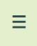
 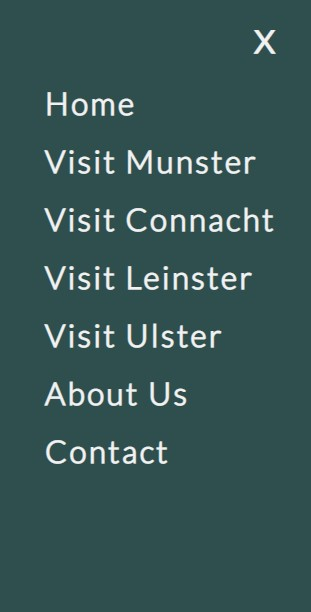

[Back to top](<#Table of Contents>)

## Logo

The logo 'HistoryOnics' is a play on words. Histrionic, meaning overly dramatic and theatrical 
is inkeeping with the dramitic history and storytelling of Ireland. The font, "Cormorant SC" may
also be seen as dramatic, coupled together with colour #2f4f4f brings a bold effect, inkeeping with
an Irish historical theme. Upon clicking on the logo, the user is brought back to the landing page.
The logo is responsive with all screens.

[Back to top](<#Table of Contents>)

## Hero Image
The [Hero Image](./assets/images/hero-image.jpeg) is of the Cliffs of Moher and is synonymous with Ireland accross the globe and presents an immediate interaction with the user with the zoom-in effect. The zoom-in effect is responsive with all screen sizes.

[Back to top](<#Table of Contents>)

## Navigation Blocks

The navigational block is provided for further interaction with the user. The user can hover over each image, which will
then become grayscale, and upon clicking on the chosen box, the user will be directed to the chosen page. Famous aspects of each provence 
have been used for imagery with bright colours to further attract the user visually. This block is responsive with all screens.

 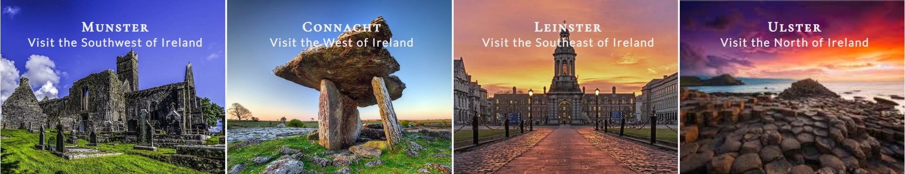

 [Back to top](<#Table of Contents>)

## Social Media
The social media icons can be accessed on all pages and will bring the user to four seperate external sites
including Twitter, Instagram, Facebook and Youtube. The setting of these icons have been influenced by the Love Running module
as per [Code Institute](https://codeinstitute.net/ie/). Icons were accessed by [Font Awesome](https://fontawesome.com/icons).

[Back to top](<#Table of Contents>)

## Videos

Videos have been incorporated as part of the Visit Pages for each county with in Provences. All video material have been sources 
via Youtube. Each video provides information as per the county it is relating to. The videos were originally 
to be placed on the left-hand-side of the page, however, this was not as visually appealing as when it is placed on the right. 
Each video is responsive on all screens and will play within the page, without increasing in size. 
Videos are sourced from:
* [Youtube](https://www.youtube.com/)

[Back to top](<#Table of Contents>)

## Maps

Maps have been incorporated on to each Visit Page, under each county seperately. The maps are responsive on
all screens, however, must be clicked within the middle of the map for small mobile devices (eg. iPhone 5). Otherwise, all 
maps will open and respond to 'View Larger Map' where indicated on map. Maps will also be responsive when clicked anywhere
on map for all screens. Maps are sourced by accessing:

* [Google Maps](https://www.google.com/maps/@52.8603236,-9.6709686,9z)

[Back to top](<#Table of Contents>)

## Contact Us
## Form Submission
## About Us
## Footer

[**Deployment**](<#deployment>)

